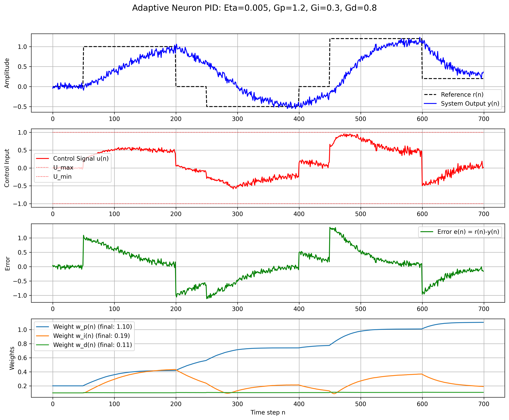
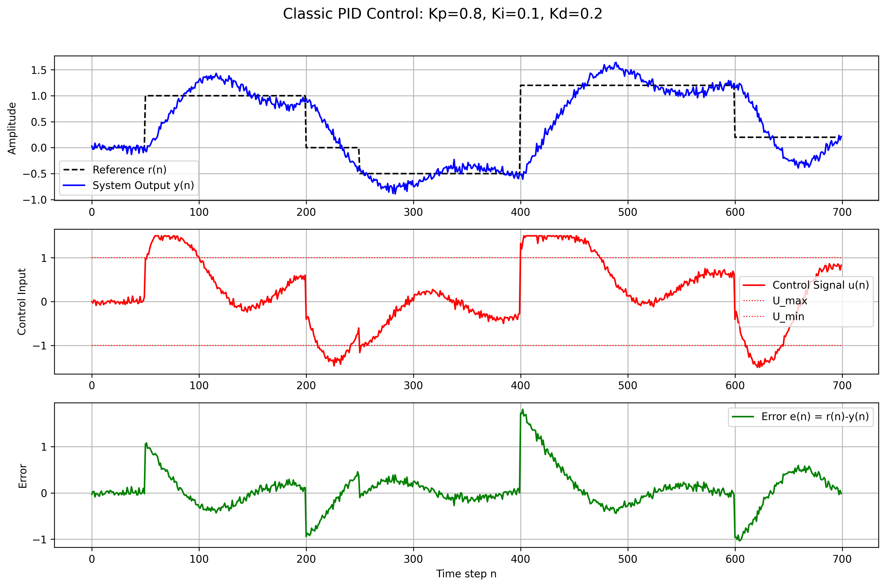

<h1 align="center">Nonlinear System Identification and Control</h1>

<p align="center">
  <em>Multi-architecture control of two nonlinear black-box systems using optimization, fuzzy logic, and neural networks</em>
</p>

<div align="center">
  <code> Python · MATLAB · Neural Networks · Fuzzy Logic · PID Control · System Identification </code>
</div>

---

### 📌 Project Summary

This project explores intelligent control strategies applied to two nonlinear, black-box dynamic systems. The goal is to identify system models and develop high-performance controllers using a mix of classical, fuzzy, and data-driven methods.

---

### 🧩 System 1 – Identification and Feedforward Control

- **Identification via step and ramp responses:**  
  → Static gain and offset derived from regression  
  → System approximated as a first-order linear model

- **Controller Design:**  
  → Feedforward control law:  
  \[
  u_{ff} = \frac{r_{desired} - C_{est}}{K_{est}}
  \]  
  → Simulated in Python and validated through step tracking performance

---

### 🧠 System 2 – Identification and Intelligent Control

#### 🔍 b.1) System Identification
- Assumed model:  
  \[
  G(s) = \frac{K}{s(\tau s + 1)}
  \]
- Nonlinear least squares used to fit step response  
- Asymptotic fitting included for comparison

#### 🔬 b.2) Neural Network Modeling
- **Architecture:** 2 input, 1 output NARX model  
- **Training:** MLP with ReLU layers, trained on 2,189 synthetic samples  
- **Validation:**  
  - R² score: 0.9801  
  - MSE: 0.0046  
  - Generalization tested on unseen input signals

#### 🤖 b.3) Controller Comparison

| Controller              | Mean Squared Error | Final 50-step Avg Error |
|------------------------|--------------------|--------------------------|
| Adaptive Neuron-PID    | **0.2831**         | **0.1541**               |
| NN Model-Based Control | 8.3008             | 3.1487                   |
| Classic PID (Kp=0.8...)| 0.1725             | 0.3452                   |

- Neuron-PID adapts gains online based on a nonlinear activation function and gradient updates  
- NN Model-Based Control uses iterative inversion to compute \( u(k) \) based on the trained forward model  
- Classical PID is used for performance benchmarking

---

### 📈 Results & Figures

<p align="center">
  <br/>
  <em>Adaptive Neuron-PID Controller</em>
</p>

<p align="center">
  <br/>
  <em>Neural Network Model-Based Control</em>
</p>

<p align="center">
  <br/>
  <em>Classic PID Control</em>
</p>

---

### 🗂️ Project Structure

```bash
.
├── Question_1
│   ├── Part_a
│   │   ├── part_a_1_2.py
│   │   └── q1a_step_response.png ...
│   ├── Part_b
│   │   ├── part_b_1.py
│   │   ├── part_b_2_1.py
│   │   ├── part_b_2_2.py
│   │   ├── part_b_3_PID.py
│   │   ├── part_b_3_NARX.py
│   │   └── part_b_4.py
│   └── outputs (.png, .npy)
├── main.tex
└── report.pdf  # Final LaTeX report 
